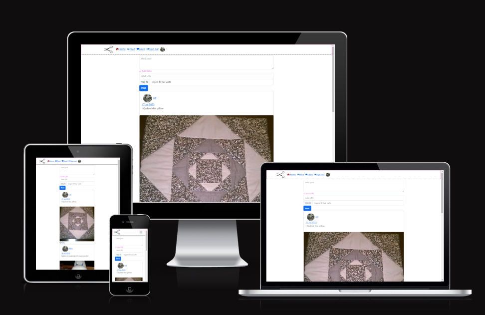

# Sewlot
#### [View the live project here](https://sewlot-07aa7e3364ec.herokuapp.com)
Welcome to Sewlot

Upon visiting our social media platform 

## UX User experience
### Project Goals

To build a website

### Strategy
To ensure an efficient 

### Planning
GitHub Project and Issues were used for Agile project planning. User Stories with acceptance criteria were defined in GitHub Issues, and development progress was managed on a Kanban board.

### Epic
As a Sewlot member, 

### User stories:
-   **Non sign in user:** As a non sign in user I am directed to the sign in form to easy sign in or to click the link to the sign up form.
-   **Account registration:** As a User I can create an account and be logged in so that I can interact whit other members.
-   **Account log in:** As a registered Site User I can log in to my account so that I can interact whit other members.
-   **Account edit username:** As a logged in User I can edit my account so that I can change username. 
-   **Account edit password:** As a logged in User I can edit my account so that I can change password.
-   **Account log out:** As a logged in Site User I can log out to prevent other people to acsess my acount.
- 
-  **Post:** As a logged in User I can create a post.
-  **Post:** As a logged in User I can edit a post I created.
-  **Post:** As a logged in User I can delete a post I created.
-  **View all posts:**  As a logged in User I can view all posts.

-  **View post and  comments:** As a logged in User I can view an individual post so that I can read the comments to it.

-   **Follow other user:** As a logged in User I can follow another user.

### User stories not done yet:
-  **Account edit profile image:** As a logged in User I can edit my account so that I can change profile image. 
-  **View some posts:**  As a logged in User I can click on feed to view only posts of users I am following.
-  **Comment on a post:** As a logged in User I can leave comments on a post so that I can be involved in the conversation
-  **Delete a Comment:** As a logged in User I can edit or delete a comment I wrote on a post so that I can change my minde
-  **Like Post:** As a logged in User I can Like another users post.
-  **Like Comment:** As a logged in User I can Like another users post.
-  **Feed** As a logged in click feed to view posts only from Users I am following.
-  **Like** As a logged in click Like to view posts I have liked.
-  **Search:** A lodge in user should be able to search for a word or words in all content on the page

## Design
Creating a creative atmosphere 

The colors used are:

### Wireframes
Wireframes were created using Balsamiq during the planning phase to visualize the website's layout on desktop and mobile devices.

## Features

###  Home page
On the home page, all users can find all posts whit the last created at the top.
## 

### Navigation bar
The top navigation is display only to a signed in user. I contains Sewlot logo, a home link, a feed link, a sign out link and a avatar of the user that leads to the signed in users profile page. When on a mobile the menu is viewed as a hamburger menu instead leaving only that and the logo in the menu.
## 

### Sign in
The sign in page contain a form with username and password. It will validate that the information provided is correct. A correct sign in redirect the user to home page.
Just under the login button, there is also a link to Sign Up if not already.
## 

### Sign up
The sign up page contains a form with username, password and a confirmation password field. There is also information about what a valid password is. They form will validate that's all information is filled in correctly.
## 

###  Display single post whit comments
A logged-in user can view comments and write a comment. A logged-in user can also edit and delete comments written by them self. A user can also like the post and comments writen by other users.
## 

###  Feed
On the Feed page, the user can see posts created of peolpe the user is follownig.
## 

###  Like
On the Like page, the user can see posts the user liked.
## 

###  Favicon
Favicon icon on the tab in the browser. Makes it easier for the user to find the page if there are many open tabs.
## 

###  Features to implement later
Add Serch. Se not done userstorys.

## Data Model

This project includes two custom models, Post and Comment.
## 

## Technologies
- HTML
- CSS
- JavaScript

Frameworks, Libraries and Programs Used:
- React
- React Bootstrap
- GitHub
- GitHub Pages
- Gitpod
- Heroku
- Cloudinary

## Testing

-   HTML  **W3C tools**
## 

-   CSS  **W3C tools**
## 

-   Lighthouse In DevTools
## 

-   JSHint

### Browser Compatibility

### Mobile responsiveness testing.

Chrome Developer tools were used for more extensive testing.

Following mobiles has been tested:

-   Huawei P20 pro

### Manual testing
|Command input              |Expected response                     |Results |
|----------------|-------------------------------|-----------------------------|
|**Home page**                |Please choose c or p:         |Pass |
|- Clicking Sewlot logo |Open Home page.         |X |
|- Clicking Home                  |All posts are displayde   |Pass |

## Deployment
 **How you set up GitHub** 

Create a [fork of the repository.](https://docs.github.com/en/get-started/quickstart/fork-a-repo#forking-a-repository)

1. Log in to GitHub and go to repository: [LinnSilver/sewlot-pj5](https://github.com/LinnSilver/sewlot-pj5)
2. Click button fork -Create a new fork.
3. Choose repository name.
4. Click Create fork.

Now you have a fork of the repository in your repository. To access code:
 
5. In your new repository:
6. Click green button: Code arrow down.
7. Choose: Create codespace on main - Code is opened in a web codespace.

After this, you do not have the files in the repository locally on your computer.
To save a copy locally on your computer:
 
9. On GitHub.com, navigate to your fork of the repository.
10. Above the list of files, click Code, Local.
11. Copy the URL for the repository.
12. Open Git Bash.
13. Change the current working directory to the location where you want the cloned directory.
14. Type  `git clone`, and then paste the URL you copied earlier.
15. Press Enter. Your local clone will be created.

It's important to commit and push correctly. Read more here:
- [How to Commit and push code from local file system to GitHub Pages.](https://docs.github.com/en/desktop/contributing-and-collaborating-using-github-desktop/making-changes-in-a-branch/committing-and-reviewing-changes-to-your-project)

After every change in the code, it's important to redo the test section. Go through:
- Python Linter
- Manual testing

 **How to set up Heroku** 
1.   Log in on Heroku.
2.  Click: Show next steps.
3.  Click: Create new app.
4.  Fill in App name and choose a region. Click: Create app.

6. Under **Settings,** choose Deployment method GitHub.
7. Click: Add Buildpack
8. Choose heroku/python. Click: Save
9. Click: Add Buildpack
10. Choose heroku/nodejs. Click: Save

11.  Under **Deploy,** choose Deployment method GitHub.
12.  **Search for a repository to connect to,**  choose repo name LinnSilver/sewlot-pj5.
13.  Click: Deploy Branch.

## Credits
### Content
All content was written by the developer. Some of the code is inspierd or coppyed from the walktrue.

