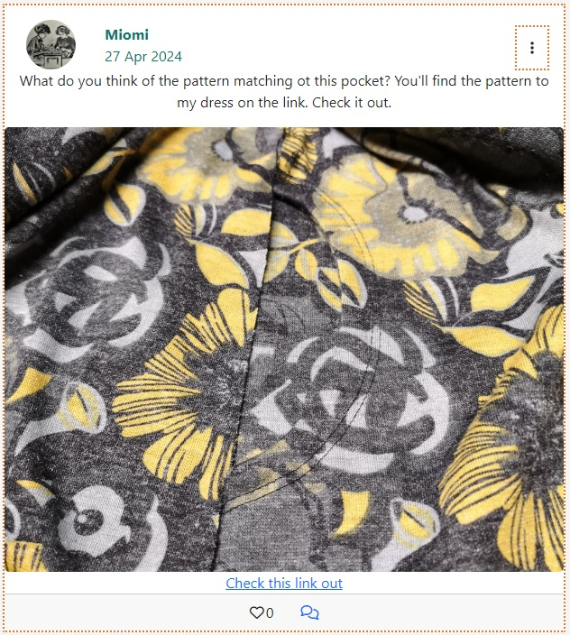
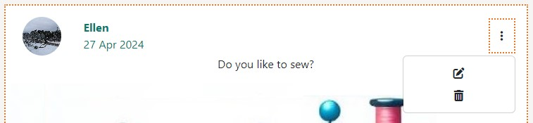

# Sewlot
#### [View the live project here](https://sewlot-07aa7e3364ec.herokuapp.com)
Welcome to Sewlot this site is for people who want to share their sewing with others. Log in and be inspired by other people's projects and fart your own.

#### [View the backend](https://github.com/LinnSilver/sew_api)

## UX User experience and Design

In terms of design, the page is stripped down so as not to distract from the content. The colors are different on everything to give a playful and inspiring impression. Lines are dashed to resemble sewing machine stitches.

The site is easily navigated from the navbar. there users find home, posts they liked, sinegen profile and sign out

## The exelance whit Rect
The reusability of components is a key concept in React and allows you to create modular and flexible code. By designing components that are reusable, I have saved time and effort by utilizing them across different parts of my React project.

### Planning
GitHub Project and Issues were used for Agile project planning. User Stories with acceptance criteria were defined in GitHub Issues, and development progress was managed on a Kanban board.
## 

### User stories:
-   **Non sign in user:** As a non sign in user I am directed to the sign in form to easy sign in or to click the link to the sign up form.
-   **Account registration:** As a User I can create an account and be logged in so that I can interact whit other members.
-   **Account log in:** As a registered Site User I can log in to my account so that I can interact whit other members.
-   **Account edit username:** As a logged in User I can edit my account so that I can change username. 
-   **Account edit password:** As a logged in User I can edit my account so that I can change password.
-   **Account log out:** As a logged in Site User I can log out to prevent other people to acsess my acount.
-  **Post:** As a logged in User I can create a post.
-  **Post:** As a logged in User I can edit a post I created.
-  **Post:** As a logged in User I can delete a post I created.
-  **View all posts:**  As a logged in User I can view all posts.
-  **View post and  comments:** As a logged in User I can view an individual post so that I can read the comments to it.
-   **Follow other user:** As a logged in User I can follow another user.
-  **Account edit profile image:** As a logged in User I can edit my account so that I can change profile image. 
-  **Like Post:** As a logged in User I can Like another users post.
-  **Like** As a logged in click Like to view posts I have liked.

### User stories not done yet:
-  **View some posts:**  As a logged in User I can click on feed to view only posts of users I am following.
-  **Comment on a post:** As a logged in User I can leave comments on a post so that I can be involved in the conversation
-  **Delete a Comment:** As a logged in User I can edit or delete a comment I wrote on a post so that I can change my minde
-  **Like Comment:** As a logged in User I can Like another users post.
-  **Feed** As a logged in click feed to view posts only from Users I am following.
-  **Search:** A lodge in user should be able to search for a word or words in all content on the page

### Wireframes
Wireframes were created using pen and paper during the planning phase to visualize the website's layout on desktop and mobile devices.
## 

## Features

###  Home page
On the home page, the navbar is att the top and users can find all posts whit the last created at the top.
## 

### Navigation bar
The top navigation is display only to a signed in user. I contains Sewlot logo that also redirect to home, a home link, a sign out link and a avatar of the user that when clicked leads to the current users profile page. When on a mobile the menu is viewed as a hamburger menu instead leaving only that and the logo in the menu.
## 

### Sign in
The sign in page contain a form with username and password. It will validate that the information provided is correct. A correct sign in redirect the user to home page.
Just under the login button, there is also a link to Sign Up if not already.
## 

### Sign up
The sign up page contains a form with username, password and a confirmation password field. There is also information about what a valid password is. They form will validate that's all information is filled in correctly.
## 

###  Display single post
Each post contains user, user avatar, date it was created or updated. The content is text and the user can also add an image and/or an external link to the desired page. At the bottom of the post there is a like icon.
## 

###  Like
Like the heart, users can click to like a post. Next to the heart is shown how many likes the post has received. Below the heart in the navbar, posts that the user liked are displayed.
## 

###  Edit and delete post
A user can update a record he himself created. by first clicking on the entry and then clicking on the small dotted menu, the options edit and share will appear.
## 
## 

###  Profile page
The profile page shows the user name, user picture, the user's description if there is one and the user's record.
The user gets to their profile page by clicking on the avatar in the navbar, then a menu for edit is also displayed.
By clicking on the user on an entry, that user's profile and a follow unfollow button are displayed, if it is not one's own profile.
## 

###  Edit profile
A user can update their profile. By first clicking on the avatar in the navbar and then clicking on the small dotted menu, the options edit profile, edit username and edit password will appear.
## 
## 

###  Features to implement later
Comments on posts and comments

## Data Model

This project includes two custom models, Post and Comment.

## Technologies
- JSX
- CSS
- JavaScript

Frameworks, Libraries and Programs Used:
- React
- React Bootstrap
- GitHub
- GitHub Pages
- Gitpod
- Heroku
- Cloudinary

## Testing

-   Lighthouse In DevTools
## 

### Browser Compatibility

The following browsers have been tested:

Chrome Version 108.0.5359.125
Mozilla Firefox Version 108.0.1
Edge Version 108.0.1462.54
Safari on macOS Version 16.1
Tested on hardware:

Asus laptop 17 inch
MacBook Pro 16 inch
MacBook Pro 15 inch
Desktop: 2560 wide monitor to MacBook
Mobile responsiveness testing.
Chrome Developer tools were used for more extensive testing.

### Following mobiles has been tested:

iPhone 5 / SE
iPhone 7
iPhone Pro Max
Samsung Galaxy a52s
Huawei P20 pro
Sony Xperia 5 III

### Manual testing
|Command input              |Expected response                     |Results |
|----------------|-------------------------------|-----------------------------|
|**Nav bar**                |         ||
|- Clicking Sewlot logo	|Home- All posts are rendered   |Pass |
|- Clicking Home		|Home- All posts are rendered 	|Pass |
|- Clicking Feed |All posts belonging to followed users are rendered |x |
|- Clicking Like icon on post    | Poste is liked, hart is reed      |Pass |
|- Clicking Like icon on post when liked |Poste is unliked, hart is not reed |Pass |
|- Clicking Liked link	|All users liked posts are rendered  |Pass |
|- Clicking Sign out	|User is signed out |Pass |
|- Clicking user avatar	|User is redirected to profile page |Pass |
|- Open page in large window| Nav bar is viewed whit all links viewed |Pass|
|- Open page in Mobile   |Nav bar is viewed as hamburger menu |Pass |
|- Clicking hamburger menu   |Nav bar links are viewed |Pass |
|  |         | |
|- If user is not signed in |Nav bar is not viewed         |Pass |
|- When user sign up|  NavBar and posts is viewed |Pass|
|- When user sign in first time | NavBar is viewed |Pass|
|- When user sign in first time | Post is viewed |X|
|- When user sign in again | NavBar and posts is viewed |Pass|
|-  |         | |
|**Profile page**
|Users own profile page  |       ||
|- Users own profile | Users own info, posts and a dropdown-menu is viewed |Pass|
|- clicking the dropdown-menu |Choises Edit profile, change username and change password is viewed   |Pass |
|- Clicking Edit profile    |  Edit profile image is rendered |Pass |
|- On Edit profile    |Uploding a new image changes the profile image   |Pass |
|- Clicking Change username | Change username form is rendered  |Pass |
|- On Change username   |Writing a new name changes the username   |Pass |
|- Clicking Change password | Change password form is rendered |Pass |
|- On Change password  |Writing a new password changes the password   |Pass |
|- On Change password  |Writing a not appropriate password throes an error |Pass|
| Another users profile page  |       ||
|- Users profile | Users info, posts and a follow button is viewed  |Pass |
|- Clicking Follow |The user is followed and the button changes to unfollow|Pass|
|- Clicking Follow   |The users posts are viewed under feed  |x |
|.|||
|**Post:**	      |  | |
|- Adding text in Add post feelde  and clicking Post|Adds the post to home |Pass|
|- Also adding an image ore/and an url |  Also adds the image/url to post |Pass |
|- Clicking Post whitout text in add post| Don't adds empty post |Pass|
|- Clicking Post whitout text in add post| Tells user its not posible to add post with out content |Pass|
|- Clicking Post, with an invalid url in add post| Tells user: Please enter a valid URL |Pass|
|- In post edit form. Clicking Save, with an invalid url in add post| Tells user: Please enter a valid URL |Pass|
|- Clicking a post, image or text |Post page is viewed |Pass |
|- Users own Post page | Post and a dropdown-menu is viewed |Pass|
|- Clicking the dropdown-menu |Choises Edit post or delete is viewed   |Pass |
|- Clicking Edit profile    |  Edit post form is rendered |Pass |
|- On Edit profile    |Change any content is updating the post   |Pass |
|- Clicking Delete   |  Deletes the post |Pass |
|- Clicking Delete   |Removes the deleted post from array without refrech |X |
|- Another users own Post page | Post is viewed |Pass|
|**Sequerety:**	      |  | |
|- Trying to sign up whit a already used Username |Error |Pass|
|- Trying to sign up whit a password blank password |Error |Pass|
|- Trying to sign up whit a password shoreter than 8 caracters |Error |Pass|
|- Trying to sign in whit a password invalid pasword |Error |Pass|
|- Trying to accses forms by url whith out singing in |Error |Pass|

### Note to testing:
During the testing, two inexplicable errors with page reload came up.
- When a user logs in to an already existing account in a new browser or after clearing cookies: The user is logged in but it is only navbar that renders corectly. Sign in form remains instead of items being loaded. when the user clicks refresh or any of the links in the navbar, the corect page is displayed. There are no error messages or anything else that shows that something is wrong. When a user signs up or logs in again on the page, everything corect is loaded with navbar and records.
- When a user clicks on delete a post, the post is deleted and the user is redirected to the homepage. But the records are not reloaded so it looks like the record is still there, it is only when the user clicks refresh or a link to something else that the page reloads and the deleted record is finally loaded. There are no error messages or anything else to suggest an error and all troubleshooting results in the bored page reloading when the record is deleted.

## Deployment
 **How you set up GitHub** 

Create a [fork of the repository.](https://docs.github.com/en/get-started/quickstart/fork-a-repo#forking-a-repository)

1. Log in to GitHub and go to repository: [LinnSilver/sewlot-pj5](https://github.com/LinnSilver/sewlot-pj5)
2. Click button fork -Create a new fork.
3. Choose repository name.
4. Click Create fork.

Now you have a fork of the repository in your repository. To access code:
 
5. In your new repository:
6. Click green button: Code arrow down.
7. Choose: Create codespace on main - Code is opened in a web codespace.

After this, you do not have the files in the repository locally on your computer.
To save a copy locally on your computer:
 
9. On GitHub.com, navigate to your fork of the repository.
10. Above the list of files, click Code, Local.
11. Copy the URL for the repository.
12. Open Git Bash.
13. Change the current working directory to the location where you want the cloned directory.
14. Type  `git clone`, and then paste the URL you copied earlier.
15. Press Enter. Your local clone will be created.

It's important to commit and push correctly. Read more here:
- [How to Commit and push code from local file system to GitHub Pages.](https://docs.github.com/en/desktop/contributing-and-collaborating-using-github-desktop/making-changes-in-a-branch/committing-and-reviewing-changes-to-your-project)

After every change in the code, it's important to redo the test section. Go through:
- Python Linter
- Manual testing

 **How to set up Heroku** 
1.   Log in on Heroku.
2.  Click: Show next steps.
3.  Click: Create new app.
4.  Fill in App name and choose a region. Click: Create app.

6. Under **Settings,** choose Deployment method GitHub.
7. Click: Add Buildpack
8. Choose heroku/python. Click: Save
9. Click: Add Buildpack
10. Choose heroku/nodejs. Click: Save

11.  Under **Deploy,** choose Deployment method GitHub.
12.  **Search for a repository to connect to,**  choose repo name LinnSilver/sewlot-pj5.
13.  Click: Deploy Branch.

## Credits
### Content
All content was written by the developer. Some of the code is inspierd or coppyed from the walktrue.

